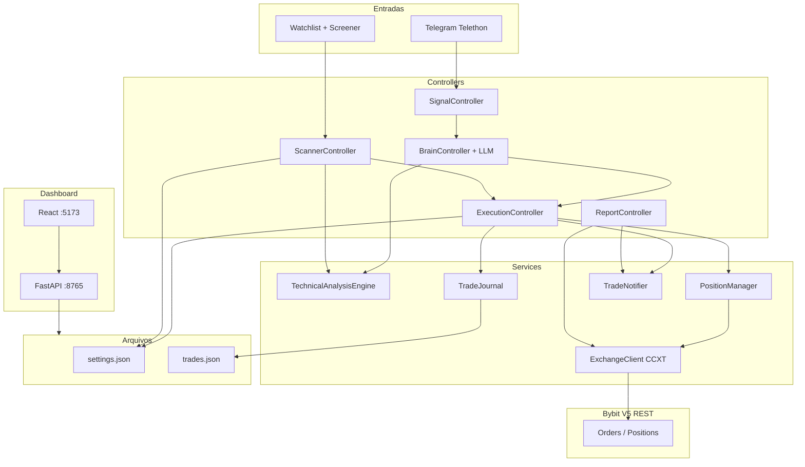
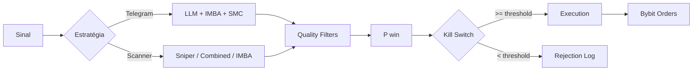
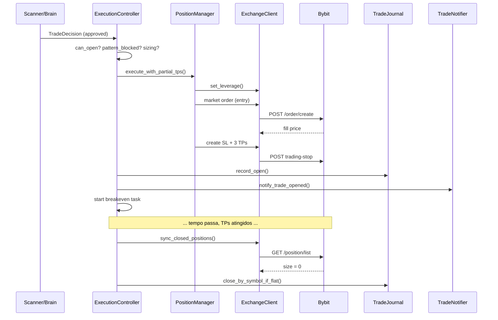
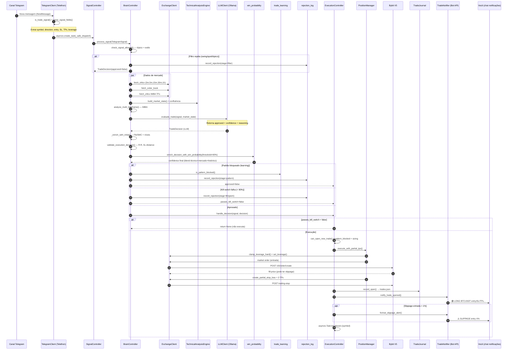

# BybitLocalTraderBot

> Guia técnico de ponta a ponta: infraestrutura, bot, dashboard, Telegram, indicadores, estratégias e ciclo de vida de um trade na Bybit.

**Documentação canônica deste repositório.** Não duplicar em outros arquivos — alterações de arquitetura, fluxos e API devem ser refletidas aqui.

**Complementos:** [AI Guidelines](AI_GUIDELINES.md) (erros, melhorias e backlog técnico) · regras para agentes em `.cursor/rules/`

---

## Índice

1. [Visão Geral](#1-visão-geral)
2. [Arquitetura e Processos](#2-arquitetura-e-processos)
3. [Fluxo do `start.bat` até o Bot Rodando](#3-fluxo-do-startbat-até-o-bot-rodando)
4. [Configuração: `.env` vs `settings.json`](#4-configuração-env-vs-settingsjson)
5. [O Bot — Componentes e Orquestração](#5-o-bot--componentes-e-orquestração)
6. [Pipeline Telegram (Sinais Externos)](#6-pipeline-telegram-sinais-externos)
7. [Pipeline Scanner (Autônomo)](#7-pipeline-scanner-autônomo)
8. [Indicadores Técnicos](#8-indicadores-técnicos)
9. [Estratégias de Entrada](#9-estratégias-de-entrada)
10. [Níveis de Execução (SL/TP)](#10-níveis-de-execução-sltp)
11. [P(win), Kill Switch e Aprendizado](#11-pwin-kill-switch-e-aprendizado)
12. [Execução na Bybit — Do Sinal ao Fechamento](#12-execução-na-bybit--do-sinal-ao-fechamento)
13. [Telegram — Entrada e Saída](#13-telegram--entrada-e-saída)
14. [Dashboard — UI, API e Comunicação](#14-dashboard--ui-api-e-comunicação)
15. [Comunicação Entre Todos os Componentes](#15-comunicação-entre-todos-os-componentes)
16. [Fluxo Completo: `start.bat` → Trade Finalizado](#16-fluxo-completo-startbat--trade-finalizado)
17. [Diagramas de Referência](#17-diagramas-de-referência)
18. [Arquivos de Dados e Logs](#18-arquivos-de-dados-e-logs)
19. [Sequência Telegram — Do Parse à Notificação](#19-sequência-telegram--do-parse-à-notificação)
20. [Mapa Completo da API REST](#20-mapa-completo-da-api-rest)
21. [Troubleshooting](#21-troubleshooting)
22. [Alterações Recentes (outros chats)](#22-alterações-recentes-outros-chats)

---

## 1. Visão Geral

O **BybitBot** é um agente de trading híbrido em **Python (asyncio)** para perpetual linear USDT na **Bybit**, com dois pipelines independentes de geração de sinais:

| Pipeline | Origem | Decisão | Confiança mínima |
|----------|--------|---------|------------------|
| **Telegram** | Canal de sinais (Telethon) | LLM (Ollama) + indicadores | 90% |
| **Scanner** | Watchlist + **market screener** (RSI + derivativos) | 100% Python (modo atual: Sniper) | 65% |

Ambos convergem no mesmo **ExecutionController**, que executa ordens via **CCXT REST** na Bybit V5, gerencia TPs parciais, breakeven e journal.

O **dashboard** (React + FastAPI) é um painel de monitoramento e configuração — **não executa trades**. Ele lê e escreve os mesmos arquivos JSON que o bot usa.

---

## 2. Arquitetura e Processos

O sistema roda em **três processos independentes**, orquestrados pelo `start.bat`:

```
┌─────────────────────────────────────────────────────────────────────┐
│                         start.bat                                    │
│  venv → Ollama → stop antigos → bot + API + dashboard + ngrok     │
└─────────────────────────────────────────────────────────────────────┘
         │                    │                      │
         ▼                    ▼                      ▼
   ┌──────────┐        ┌────────────┐        ┌─────────────┐
   │ main.py  │        │ FastAPI    │        │ Vite React  │
   │ (bot)    │        │ :8765      │        │ :5173       │
   │          │        │            │        │             │
   │ Trading  │        │ dashboard_ │        │ Dashboard   │
   │ Agent    │        │ data.py    │        │ UI          │
   └────┬─────┘        └─────┬──────┘        └──────┬──────┘
        │                    │                      │
        └────────────────────┼──────────────────────┘
                             ▼
              ┌──────────────────────────────┐
              │   Arquivos compartilhados     │
              │   data/settings.json          │
              │   data/trades.json            │
              │   data/watchlist.txt          │
              │   .run/bot.log / bot.pid      │
              └──────────────────────────────┘
```

| Processo | Porta / Artefato | Responsabilidade |
|----------|------------------|------------------|
| **Trading Bot** | `main.py` → `.run/bot.pid`, `.run/bot.log` | Escuta Telegram, scanner, execução Bybit |
| **Dashboard API** | `127.0.0.1:8765` | REST + SSE; leitura/escrita de arquivos |
| **Dashboard UI** | `127.0.0.1:5173` | Interface React; proxy `/api` → 8765 |

**Não há IPC direto** entre bot e dashboard. A sincronização é feita pelo **filesystem** (JSON + logs).

---

## 3. Fluxo do `start.bat` até o Bot Rodando

### 3.1 O que o `start.bat` faz

```
[1/5] Python / venv
      → Cria .venv se não existir
      → pip install -r requirements.txt

[2/5] Ollama
      → Verifica http://localhost:11434
      → Se offline, inicia via start_ollama_hidden.ps1

[3/5] Encerra instâncias antigas
      → stop_bot.ps1, stop_dashboard.ps1, stop_ngrok.ps1

[4/5] Sobe serviços em background
      → start_services_hidden.ps1:
          • Bot:     scripts/run_bot_background.cmd → main.py
          • API:     scripts/run_dashboard_api.py (porta 8765)
          • UI:      npm run dev no dashboard/ (porta 5173)
          • ngrok:   túnel remoto (opcional, requer NGROK_TOKEN)

[5/5] Exibe URLs e pausa
```

### 3.2 Startup interno do bot (`main.py` → `TradingAgent`)

```python
asyncio.run(main())
  └─ TradingAgent.__init__()
       ├─ Settings (.env)
       ├─ RuntimeConfigStore (data/settings.json)
       ├─ TelegramClient, ExchangeClient, LLMClient
       ├─ TechnicalAnalysisEngine
       ├─ TradeNotifier
       └─ Controllers: Execution, Signal, Brain, Scanner, Report

  └─ agent.start()
       1. runtime.reload() + setup_logging
       2. _wire_pipeline():
            signal_ctrl.on_signal → brain_ctrl.process_signal
            brain_ctrl.on_decision → execution_ctrl.handle_decision
       3. exchange.connect()        # CCXT load_markets (falha não aborta)
       4. llm.warmup()              # Ollama (falha não aborta)
       5. resume_breakeven_for_open_trades()
       6. scanner_ctrl.start()      # asyncio.Task "imba-scanner"
       7. report_ctrl.start()       # asyncio.Task "pnl-report"
       8. signal_ctrl.start()       # bloqueia em run_until_disconnected()
```

O processo principal fica preso no **listener do Telegram**. Scanner e relatório PnL rodam em **tasks asyncio paralelas**.

### 3.3 Resiliência no startup

- Falha na Bybit → bot continua (só loga erro)
- Falha no Ollama → bot continua (pipeline Telegram fica degradado)
- Erros em callbacks downstream → logados, loop não cai

---

## 4. Configuração: `.env` vs `settings.json`

Existem **duas camadas** de configuração:

| Camada | Arquivo | Hot-reload? | Conteúdo |
|--------|---------|-------------|----------|
| **Secrets / conexão** | `.env` | **Não** (restart) | API keys Bybit, credenciais Telegram, Ollama, `SETTINGS_PATH` |
| **Regras operacionais** | `data/settings.json` | **Sim** | Risco, scanner, IMBA, confidence, estratégias, learning |

### `.env` — variáveis principais

```env
# Bybit
BYBIT_MODE=demo|testnet|live
BYBIT_API_KEY_*
BYBIT_API_SECRET_*

# Telegram (entrada de sinais — Telethon)
TELEGRAM_API_ID=
TELEGRAM_API_HASH=
TELEGRAM_CHANNEL_ID=
TELEGRAM_SESSION_NAME=bybit_bot_session

# Telegram (notificações — Bot API)
TELEGRAM_BOT_TOKEN=
TELEGRAM_NOTIFY_CHAT_ID=

# LLM
OLLAMA_HOST=http://localhost:11434
OLLAMA_MODEL=

# Paths
SETTINGS_PATH=data/settings.json
```

### `settings.json` — seções principais (config atual)

| Seção | Função |
|-------|--------|
| `confidence` | Kill switch: telegram 90%, scanner 65% |
| `timeframes` | TFs de análise (3m–1h), execução (5m) |
| `risk` | 1% por trade, max 3 posições, leverage 10–30x |
| `imba` | Fib levels, TPs 1/2/3%, close 50/30/20% |
| `scanner` | Intervalo 300s, screener RSI discovery_only |
| `breakeven` | `after_tp: 2` (move SL para entrada após TP2) |
| `strategies.scanner` | `entry_strategy: "sniper"`, modo autonomous |
| `strategies.telegram` | LLM + IMBA + SMC + P(win) + learning |
| `learning` | Bloqueio por padrões ruins, paths de rejeições |
| `pnl_report` | Relatório horário via Telegram |

### Hot-reload do `settings.json`

O bot chama `runtime.reload()` em praticamente todo ciclo (scanner, brain, execution). O `RuntimeConfigStore` compara `st_mtime` do arquivo; se mudou, revalida com Pydantic. Se inválido, **mantém config anterior**.

Mudanças feitas no dashboard aparecem no bot no **próximo reload** — tipicamente dentro de um ciclo do scanner (até ~300s).

---

## 5. O Bot — Componentes e Orquestração

### 5.1 Estrutura de pastas

```
BybitBot/
├── main.py                    # Entry point
├── start.bat                  # Orquestrador de infra
├── .env                       # Secrets
├── data/
│   ├── settings.json          # Regras operacionais
│   ├── watchlist.txt          # Símbolos do scanner
│   ├── trades.json            # Journal
│   ├── rejections.json        # Rejeições (aprendizado)
│   └── approvals.json         # Aprovações
├── src/
│   ├── config/                # settings.py + runtime_config.py
│   ├── controllers/           # Orquestração dos pipelines
│   ├── services/              # Exchange, Telegram, LLM, journal...
│   ├── strategies/            # Indicadores, IMBA, SMC, validação
│   ├── models/                # Schemas Pydantic
│   ├── api/                   # FastAPI do dashboard
│   └── utils/
├── dashboard/                 # React + Vite
├── tools/                     # Backtest vetorial isolado (VectorBT)
└── scripts/                   # start/stop, diagnóstico
```

### 5.2 Controllers

| Controller | Arquivo | Função |
|------------|---------|--------|
| **SignalController** | `signal_controller.py` | Escuta mensagens do canal Telegram |
| **BrainController** | `brain_controller.py` | Pipeline Telegram: dados → LLM → decisão |
| **ScannerController** | `scanner_controller.py` | Loop autônomo na watchlist |
| **ExecutionController** | `execution_controller.py` | Execução, limites, journal, breakeven |
| **ReportController** | `report_controller.py` | Relatório PnL periódico via Telegram |

### 5.3 Services

| Service | Arquivo | Função |
|---------|---------|--------|
| **ExchangeClient** | `exchange_client.py` | Wrapper CCXT async Bybit V5 |
| **PositionManager** | `position_manager.py` | Sizing, TPs parciais, breakeven |
| **TradeJournal** | `trade_journal.py` | Persistência em `trades.json` |
| **TelegramClient** | `telegram_client.py` | Telethon — escuta de sinais |
| **TradeNotifier** | `trade_notifier.py` | Bot API — notificações outbound |
| **LLMClient** | `llm_client.py` | Ollama — avaliação de trades |
| **RuntimeConfigStore** | `runtime_config_store.py` | Hot-reload do settings.json |

### 5.4 Wiring do pipeline (callbacks in-process)

```python
# main.py
signal_ctrl.on_signal(brain_ctrl.process_signal)
brain_ctrl.on_decision(execution_ctrl.handle_decision)
```

Não há filas de mensagens nem WebSocket no core do bot. O padrão é **callbacks encadeados** dentro do mesmo processo asyncio.

### 5.5 Tasks em background

| Task | Nome | Função |
|------|------|--------|
| Scanner loop | `imba-scanner` | Varredura periódica (300s) |
| Screener | `market-screener` | Descoberta RSI em background |
| PnL report | `pnl-report` | Relatório horário |
| Breakeven | `breakeven-{symbol}` | Monitor por trade aberto |

---

## 6. Pipeline Telegram (Sinais Externos)

### 6.1 Fluxo

```
Canal Telegram (mensagem nova)
  │
  ▼
TelegramClient (Telethon events.NewMessage)
  │ parse: símbolo, direção, entry, SL, TPs, leverage
  │ filtro: tópicos de fórum, estilo de trade
  ▼
SignalController
  ▼
BrainController.process_signal()
  │
  ├─ Filtros de estilo/tópico (daytrade/scalp OK; swing/spot rejeitados)
  ├─ Fetch OHLCV multi-TF + orderbook (Bybit REST)
  ├─ IMBA multi-TF + MarketState + confluência
  ├─ LLM evaluate_trade (Ollama)
  ├─ Enriquecimento IMBA + níveis de execução (Fib/SMC)
  ├─ validate_execution_decision (R:R, distância SL)
  ├─ enrich_decision_with_win_probability
  └─ learning block (padrões ruins)
  │
  ▼
TradeDecision (approved + confidence >= 90%?)
  │
  ▼
ExecutionController.handle_decision()
```

### 6.2 Parsing de sinais

O `telegram_parse.py` extrai campos de mensagens de texto livre:

- Símbolo (ex: `BTCUSDT`)
- Direção (`LONG` / `SHORT`)
- Preço de entrada
- Stop loss
- Take profits (até 3)
- Leverage sugerida

Filtros adicionais em `trade_filters.py` e `telegram_topics.py`:
- `topic_ids` / `topic_names` — só processa tópicos específicos do fórum
- `allowed_trade_styles` — daytrade, scalp
- `reject_trade_styles` — swing, spot

### 6.3 Papel da LLM

A LLM (Ollama local) recebe:
- Resumo técnico multi-TF (indicadores, confluência, IMBA)
- Dados do sinal original
- Contexto de mercado (orderbook, volume)

Retorna: `approved` (bool) + `confidence` (0–1) + `reasoning`.

A LLM é o **juiz final** no pipeline Telegram — mas ainda precisa passar pelo kill switch de P(win) >= 90%.

**Notas técnicas (correções recentes):**
- `_normalize_confidence()` aceita `0.54` ou `54` (percentual)
- Campo `llm_confidence` preservado separado do P(win) final
- Retry automático se o modelo ecou JSON de `imba_analysis` em vez do schema de decisão

---

## 7. Pipeline Scanner (Autônomo)

### 7.1 Loop principal

```
ScannerController._loop (a cada scanner.interval_seconds = 300s)
  │
  ├─ runtime.reload()          # hot-reload settings
  ├─ sync_closed_positions()   # journal ↔ exchange
  │
  ├─ _scan_all()
  │    ├─ resolve símbolos:
  │    │    • watchlist.txt (fixos)
  │    │    • screener RSI (discovery_only — só adiciona candidatos)
  │    ├─ verifica slots disponíveis (max 3 posições)
  │    ├─ avalia símbolos em lotes (Semaphore + asyncio.gather)
  │    └─ execute_decisions_batch() — top N por confidence
  │
  └─ sleep(interval)
```

### 7.2 Estratégia atual: `sniper` (config)

Com `strategies.scanner.entry_strategy = "sniper"` e `mode = "autonomous"`:

```
_watchlist + screener_
  │
  ▼
_evaluate_sniper()
  │
  ├─ evaluate_sniper_setup (Sniper Entry + Breakout Probability)
  ├─ quality_filters (confluência, volume, R:R, Kalman...)
  ├─ build_sniper_scanner_decision
  ├─ apply_execution_levels + validate
  ├─ enrich_decision_with_win_probability (threshold 65%)
  └─ learning block
  │
  ▼
execute_decisions_batch()
```

**Sem LLM** no scanner no modo atual. Tudo é Python puro.

### 7.3 Market Screener (descoberta automática — substitui CoinGlass)

Módulo: `src/strategies/market_screener.py` — roda em background (`market-screener` task).

**Fluxo em 5 fases:**

```
1. Busca todos os perpétuos USDT da Bybit (1 chamada — volume, funding, variação 24h)
2. Filtra por liquidez mínima ($500k turnover 24h)
3. Calcula RSI(14) Wilder em 15m, 1h, 4h, 1d (igual RSI Heatmap CoinGlass)
4. Aplica regras de setup + derivativos (funding, OI, account ratio)
5. Top candidatos entram no universo do scanner
```

**Thresholds RSI (alinhados ao CoinGlass):**

| Parâmetro | Valor |
|-----------|-------|
| `rsi_overbought_min` | **70** (qualquer TF ≥ 70 = overbought) |
| `rsi_oversold_max` | **30** (qualquer TF ≤ 30 = oversold) |

Modo `discovery_only: true` — **só adiciona candidatos ao universo de scan**, não define direção de entrada sozinho. A direção vem da estratégia Sniper/combined/IMBA.

---

## 8. Indicadores Técnicos

### 8.1 Camada base (`indicators.py`)

OHLCV → DataFrame pandas → **pandas-ta**:

| Indicador | Parâmetros |
|-----------|------------|
| RSI | 6, 12, 24 períodos |
| MACD | padrão |
| SMA / EMA | múltiplos períodos |
| Bollinger Bands | padrão |
| ADX | força de tendência |
| Supertrend | direção |
| Ichimoku | nuvem |
| ATR | volatilidade |
| VWAP | intraday |
| Divergências | RSI/MACD |

Saída: dict JSON-serializável (sem DataFrames na LLM).

### 8.2 Motor multi-TF (`technical_analysis.py`)

Para cada timeframe configurado em `timeframes.analysis`:

```
build_timeframe_snapshot(tf)
  ├─ compute_indicators (RSI, MACD, ATR...)
  ├─ compute_fibonacci_levels
  ├─ detect_market_patterns (price action)
  └─ resumo OHLCV 24h

build_market_state()
  └─ compute_confluence() → score long/short 0–100
```

### 8.3 Módulos plugáveis (`indicator_modules/`)

Contrato: `ModuleResult` / `CombinedSignal` em `base.py`.

| Módulo | Arquivo | Função |
|--------|---------|--------|
| **Trend Speed** | `trend_speed.py` | ZMA, pullback em tendência |
| **Range Detector** | `range_detector.py` | LuxAlgo-style range |
| **Sniper Entry** | `sniper_entry.py` | Painel bull/bear score |
| **Breakout Probability** | `breakout_probability.py` | Confirma próximo candle |
| **Combined** | `combined.py` | Orquestra os três + screener bias |

### 8.4 IMBA ALGO (`imba_algo.py`, `imba_analyzer.py`)

Indicador proprietário do projeto:
- Canal de preço com sensibilidade configurável
- Sinais multi-TF (5m, 15m, 30m, 1h)
- Direção: bullish / bearish / neutro
- Usado no pipeline Telegram e como fallback de níveis

### 8.5 SMC — Smart Money Concepts (`smc_levels.py`)

- Swings de estrutura (lookback 80 candles)
- Order blocks
- Zonas de liquidez
- SL/TP baseados em estrutura de mercado

### 8.6 Kalman (`kalman.py`, `kalman_entry.py`)

Filtro de tendência/reversão:
- `require_kalman_align` — só entra se Kalman confirma direção
- `reject_kalman_reversal_against` — rejeita se Kalman indica reversão contra

### 8.7 Fibonacci (`fib_execution_levels.py`)

Quando `imba.use_fib_levels = true`:
- Calcula níveis Fibonacci no TF de estrutura (5m)
- SL abaixo/acima do swing + buffer
- TPs nos níveis Fib (0.382, 0.618, etc.)
- Prioridade máxima na escolha de níveis de execução

---

## 9. Estratégias de Entrada

### 9.1 Configuração modular (`strategy_config.py`)

Dois pipelines independentes configuráveis em `settings.json`:

```json
"strategies": {
  "scanner": {
    "entry_strategy": "sniper",   // imba | combined | sniper
    "mode": "autonomous",         // autonomous | llm_assisted
    "imba": false,
    "indicators": { "sniper": true, ... },
    "smc": false,
    "quality_filters": true,
    "pwin": true,
    "learning": true
  },
  "telegram": {
    "llm": true,
    "imba": true,
    "smc": true,
    "pwin": true,
    "learning": true
  }
}
```

### 9.2 Estratégias disponíveis

| Estratégia | Onde | Lógica |
|------------|------|--------|
| **IMBA ALGO** | `imba_algo.py` | Canal de preço + sensibilidade; sinais multi-TF |
| **Combined** | `indicator_modules/combined.py` | Trend Speed + Range Detector + Sniper; regime trend/range |
| **Sniper** | `indicator_modules/sniper_strategy.py` | Sniper Entry (SL/TP ATR) + Breakout Probability |

**Níveis Sniper (cálculo único):**
- `entry` = close do candle de execução (5m)
- `risk` = ATR × 1.5
- TPs = **1.2R, 2.0R, 3.0R** (`sniper_entry.py`)

### 9.3 Estratégia Sniper (ativa no scanner)

```
1. Sniper Entry analisa painel bull/bear score no TF de execução (5m)
   → min_sniper_score_pct: 50%

2. Breakout Probability confirma próximo candle
   → min_breakout_probability_pct: 60%

3. Screener fornece bias direcional (RSI multi-TF)

4. Quality filters validam:
   - Confluência >= 65
   - Volume ratio >= 0.45
   - R:R TP1 >= 1.0
   - SL distance em múltiplos de ATR

5. P(win) >= 65% → aprovado
```

### 9.4 Estratégia Combined

Orquestra três módulos:
- **Trend Speed** — detecta tendência e pullbacks
- **Range Detector** — identifica consolidação
- **Sniper Entry** — timing de entrada

Define regime (trend vs range) e exige alinhamento dos módulos ativos.

### 9.5 Filtros de qualidade (`scanner_filters.py`)

Aplicados após a estratégia de entrada:

| Filtro | Threshold atual |
|--------|-----------------|
| Confluência mínima | 65 |
| Spread confluência | 12 |
| Alinhamento IMBA multi-TF | obrigatório |
| Volume ratio | >= 0.45 |
| SL/ATR múltiplo | 0.55 – 2.5 |
| R:R TP1 | >= 1.0 |
| Kalman align | obrigatório |
| Market pattern | obrigatório (winrate histórico >= 80%) |

---

## 10. Níveis de Execução (SL/TP)

### 10.1 Prioridade de escolha (`execution_levels.py`)

```
1. Fibonacci scalp (se imba.use_fib_levels = true)
      ↓ senão
2. SMC (swings, order blocks, liquidez)
      ↓ senão
3. Níveis brutos do sinal (IMBA / combined / sniper)
```

### 10.2 Validação final (`trade_validation.py`)

- `validate_execution_decision()` — R:R mínimo, distância SL, contagem de TPs
- `apply_liquidation_safe_stop_loss()` — SL não pode estar além do preço de liquidação
- `shift_execution_levels()` — ajusta níveis ao preço real de fill (slippage)

### 10.3 Estrutura de TPs parciais

Config atual em `settings.json`:

```json
"imba": {
  "tp_percents": [1.0, 2.0, 3.0],
  "tp_close_pcts": [50.0, 30.0, 20.0]
}
```

| TP | % do movimento | % da posição fechada |
|----|----------------|----------------------|
| TP1 | 1% | 50% |
| TP2 | 2% | 30% |
| TP3 | 3% | 20% |

SL fecha o restante (100% se nenhum TP atingido).

---

## 11. P(win), Kill Switch e Aprendizado

### 11.1 P(win) — probabilidade objetiva (`win_probability.py`)

Blend de scores ponderados:

| Componente | Peso | Fonte |
|------------|------|-------|
| Técnico | 35% | Indicadores, confluência |
| Mercado | 25% | Volume, spread, orderbook |
| Setup | 20% | R:R, distância SL, padrão |
| Histórico | 20% | Aprendizado bayesiano |

### 11.2 Kill switch

```python
TradeDecision.passes_kill_switch = approved AND confidence >= threshold
```

| Pipeline | Threshold |
|----------|-----------|
| Telegram | 90% |
| Scanner | 65% |

Se não passa → `record_rejection()` em `rejections.json`.

### 11.3 Aprendizado (`trade_learning.py`)

Após cada trade fechado:
- Extrai "família de padrão" (símbolo + direção + setup)
- Calcula winrate histórico por família
- **Bloqueia** famílias com WR < 40% (min 3 amostras)
- **Bloqueia** famílias com loss grave (< -0.8%)
- Penaliza P(win) de padrões ruins em novas entradas

Logs:
- `data/rejections.json` — sinais rejeitados (com motivo)
- `data/approvals.json` — sinais aprovados

---

## 12. Execução na Bybit — Do Sinal ao Fechamento

### 12.1 Pré-execução (`ExecutionController._execute`)

```
1. can_open_new_trade()
   → limite de posições (3 prod / 10 demo)
   → sem duplicata no símbolo

2. trade_learning.is_pattern_blocked()
   → família de padrão bloqueada?

3. apply_liquidation_safe_stop_loss()
   → SL seguro vs preço de liquidação

4. PositionManager.compute_size_for_trade()
   → sizing por risco (1% do saldo)
   → cap por max_position_pct (5%)
   → leverage via clamp_leverage_hard() — cap 30x absoluto + config + tier Bybit

5. Checagem max_portfolio_risk_pct (3%)
   → risco total das posições abertas
```

### 12.2 Execução na exchange (`ExchangeClient`)

```
set_leverage(symbol, leverage)
  │
  ▼
market order (entrada)
  │ fill real → shift_execution_levels()
  ▼
create_partial_stop_loss()     → SL 100% da posição
  │
  ▼
create_partial_take_profit()   → TP1 (50%)
create_partial_take_profit()   → TP2 (30%)
create_partial_take_profit()   → TP3 (20%)
  │
  ▼ (se proteções falharem)
emergency_close_position()     → reduce-only market
```

Todas as ordens são **REST** via CCXT async — sem WebSocket no bot.

### 12.3 Pós-execução

```
TradeJournal.record_open()     → data/trades.json
TradeNotifier.notify_trade_opened()  → Telegram Bot API
asyncio.create_task(_monitor_breakeven)  → task por trade
```

### 12.4 Monitor de breakeven

Task `breakeven-{symbol}` roda em loop (poll a cada 5s, até 7 dias):

```
Após TP{N} atingido (N = breakeven.after_tp = 2):
  → move_stop_loss_to_entry()
  → SL vai para preço de entrada (protege lucro parcial)
```

### 12.5 Fechamento da posição

| Evento | O que acontece |
|--------|----------------|
| **TP1 atingido** | 50% da posição fecha (reduce-only) |
| **TP2 atingido** | 30% fecha + breakeven ativado (SL → entry) |
| **TP3 atingido** | 20% restante fecha |
| **SL atingido** | Posição restante fecha (pode ser 100% se nenhum TP) |
| **Sync journal** | `sync_closed_positions()` detecta size=0 na exchange |

### 12.6 Sync journal ↔ exchange

```
sync_closed_positions() (a cada ciclo do scanner):
  para cada trade aberto no journal:
    size = fetch_position_size(symbol)
    se size <= 0:
      close_by_symbol_if_flat(symbol, last_price)
      → grava PnL estimado, close_reason
      → features vão para aprendizado bayesiano
```

---

## 13. Telegram — Entrada e Saída

O projeto usa **dois mecanismos distintos** de Telegram:

### 13.1 Entrada — Telethon (user client)

| Aspecto | Detalhe |
|---------|---------|
| Biblioteca | Telethon |
| Credenciais | `TELEGRAM_API_ID`, `TELEGRAM_API_HASH`, `TELEGRAM_CHANNEL_ID` |
| Sessão | SQLite (`bybit_bot_session.session`) |
| Modo | Passivo — escuta `events.NewMessage` no canal |
| Comandos | **Não existem** (`/start`, `/status`, etc.) |

Fluxo:
```
Canal → NewMessage handler → parse → filtros → BrainController
```

Dispatch via `asyncio.create_task(_safe_dispatch)` — não bloqueia o listener.

### 13.2 Saída — Bot API (notificações)

| Aspecto | Detalhe |
|---------|---------|
| Biblioteca | `urllib` (HTTP POST) |
| Credenciais | `TELEGRAM_BOT_TOKEN`, `TELEGRAM_NOTIFY_CHAT_ID` |
| Modo | Fire-and-forget outbound |

### 13.3 Triggers de notificação

| Evento | Origem | Conteúdo |
|--------|--------|----------|
| **Trade aberto** | `ExecutionController` | Entry, SL, TPs, leverage, sizing |
| **Slippage > 1%** | `slippage_guard` + `ExecutionController` | Alerta na entrada ou ao fechar posição |
| **Relatório PnL** | `ReportController` (a cada 3600s) | W/L fills + **posições agrupadas** (trade lógico) |

Se `TELEGRAM_BOT_TOKEN` ou `TELEGRAM_NOTIFY_CHAT_ID` ausentes → notificações desligadas (só log).

---

## 14. Dashboard — UI, API e Comunicação

### 14.1 Stack

- **React 18** + TypeScript + Vite 6
- **Tailwind CSS** + componentes próprios
- **recharts** (equity/PnL), **lightweight-charts** (candles)
- **FastAPI** na porta 8765

### 14.2 Páginas

| Rota | Página | Função |
|------|--------|--------|
| `/` | Dashboard | Status, saldo, stats, equity, ranking, **PnL Bybit agrupado** |
| `/settings` | Settings | Risco, scanner, IMBA, learning, timeframes |
| `/strategies` | Strategies | Toggles do pipeline scanner |
| `/watchlist` | Watchlist | Símbolos + breakout outlook |
| `/trades` | Trades | Journal completo |
| `/analytics` | Analytics | Gráficos PnL |
| `/learning` | Learning | Padrões, calibração, rejeições |
| `/analysis` | Analysis | Rejeições/aprovações com chart + Pine replay |

### 14.3 API REST (endpoints principais)

| Método | Endpoint | Função |
|--------|----------|--------|
| GET | `/api/health` | Health check |
| GET | `/api/status` | Bot running, PID, modo, stats |
| GET/PUT | `/api/settings` | Ler/gravar `settings.json` |
| GET/PUT | `/api/watchlist` | Ler/gravar `watchlist.txt` |
| GET | `/api/trades` | Journal |
| GET | `/api/trades/charts` | Gráficos equity/PnL |
| GET | `/api/trades/exchange-pnl` | PnL real Bybit (fills + posições agrupadas) |
| GET | `/api/trades/strategies/ranking` | Ranking por estratégia/padrão |
| GET | `/api/learning` | Relatório de aprendizado |
| GET | `/api/analysis` | Rejeições, aprovações, sinais |
| GET | `/api/account` | Saldo USDT (Bybit on-demand) |
| PUT | `/api/account/mode` | Altera `BYBIT_MODE` no `.env` |
| GET | `/api/events` | **SSE** — push quando arquivos mudam |
| POST | `/api/backtest` | Backtest vetorial isolado (VectorBT, sem execução ao vivo) |

### 14.4 Comunicação frontend ↔ API

| Mecanismo | Intervalo | Uso |
|-----------|-----------|-----|
| **Polling** | 5–30s | Status, settings, saldo, charts |
| **SSE** | ~2s (server-side) | `/api/events` — fingerprint de arquivos |

O SSE **não é WebSocket**. A API observa `mtime` de `settings.json`, `trades.json`, `rejections.json`, `bot.log` e emite evento quando muda.

### 14.5 O que o dashboard NÃO faz

- Não inicia/para o bot (isso é `start.bat` / `stop.bat`)
- Não executa trades
- Não se comunica diretamente com o bot (só via arquivos)

### 14.6 Gráfico de Análise — níveis do bot no Pine

Quando `chart_snapshot.levels` existe (entry, stop_loss, take_profits gravados pelo bot), o `pineToChart.ts` **mantém o modelo visual Pine** (segmentos, cores, labels ENTRY/SL/TP) mas **sobrescreve os preços** pelos valores reais da decisão do bot. Sem `levels` → comportamento anterior (só Pine/replay).

### 14.7 Card PnL Bybit (`ExchangePnlCard`)

Componente no Dashboard (`/`) que consome `GET /api/trades/exchange-pnl?period=week` e exibe:
- **Fills (API bruta)** — fechamentos parciais da Bybit (win rate inflado por TPs)
- **Posições agrupadas** — trades lógicos (símbolo + lado + entry), WR e PF honestos

---

## 15. Comunicação Entre Todos os Componentes

### 15.1 Mapa de comunicação

```
                    ┌─────────────┐
                    │   Canal     │
                    │  Telegram   │
                    └──────┬──────┘
                           │ Telethon (real-time)
                           ▼
┌──────────┐        ┌─────────────┐        ┌──────────┐
│ Dashboard│◄─REST─►│  FastAPI    │        │  Bybit   │
│  React   │  SSE   │  :8765      │        │  V5 REST │
└────┬─────┘        └──────┬──────┘        └────▲─────┘
     │                     │                     │
     │              ┌──────┴──────┐              │
     │              │  Arquivos   │              │ CCXT
     └─────────────►│  JSON/txt   │◄─────────────┘
                    │  .run/log   │
                    └──────┬──────┘
                           │
                    ┌──────┴──────┐
                    │  main.py    │
                    │  (bot)      │
                    └──────┬──────┘
                           │ Bot API (HTTP)
                           ▼
                    ┌─────────────┐
                    │  Telegram   │
                    │ Notificações│
                    └─────────────┘
```

### 15.2 Tabela de quem escreve/lê cada arquivo

| Arquivo | Escrito por | Lido por |
|---------|-------------|----------|
| `data/settings.json` | Dashboard API | Bot, API |
| `data/trades.json` | Bot (TradeJournal) | API, Bot |
| `data/rejections.json` | Bot (rejection_log) | API |
| `data/approvals.json` | Bot (approval_log) | API |
| `data/watchlist.txt` | Dashboard API | Bot (WatchlistStore) |
| `.env` | Dashboard (modo), manual | Bot, API |
| `.run/bot.pid` | Bot | API (status) |
| `.run/bot.log` | Bot | API (tail logs) |

### 15.3 Padrões de comunicação no bot

| Padrão | Uso |
|--------|-----|
| **Callbacks encadeados** | signal → brain → execution |
| **asyncio.Tasks** | scanner, screener, breakeven, PnL report |
| **Filesystem** | settings hot-reload, journal, rejections |
| **REST polling** | Bybit OHLCV, posições, ordens |
| **Telethon events** | Telegram inbound (real-time) |
| **HTTP POST** | Telegram outbound (notificações) |

**Não há**: Redis, PostgreSQL, filas de mensagens, WebSocket no core do bot.

---

## 16. Fluxo Completo: `start.bat` → Trade Finalizado

### Cenário: Scanner encontra setup Sniper em `SOLUSDT`

```
═══════════════════════════════════════════════════════════════
 FASE 1 — INFRAESTRUTURA
═══════════════════════════════════════════════════════════════

[Usuário] Duplo-clique em start.bat
    │
    ├─ [1/5] venv OK / pip install
    ├─ [2/5] Ollama online
    ├─ [3/5] Para instâncias antigas
    ├─ [4/5] Sobe bot + API + dashboard + ngrok
    └─ [5/5] URLs exibidas

[main.py] TradingAgent.start()
    ├─ Carrega settings.json
    ├─ Conecta Bybit (CCXT)
    ├─ Warmup Ollama
    ├─ Resume breakeven de trades abertos
    ├─ Inicia scanner task (300s)
    ├─ Inicia PnL report task (3600s)
    └─ Inicia Telethon listener (bloqueia)

═══════════════════════════════════════════════════════════════
 FASE 2 — SCANNER CYCLE (t=0, 300, 600...)
═══════════════════════════════════════════════════════════════

[ScannerController._loop]
    ├─ runtime.reload()  ← pega settings atualizados do dashboard
    ├─ sync_closed_positions()
    │
    ├─ Resolve símbolos:
    │    watchlist.txt: [BTC, ETH, SOL, ...]
    │    + screener: [AVAX, NEAR, ...] (RSI discovery)
    │
    ├─ available_trade_slots() → 2 vagas (1 posição aberta)
    │
    └─ _scan_all() em lotes de 25, concorrência 10

        [SOLUSDT] _evaluate_sniper()
            ├─ Fetch OHLCV 5m, 15m, 30m, 1h
            ├─ Sniper Entry: bull_score = 72%  ✓ (min 50%)
            ├─ Breakout Probability: 68%  ✓ (min 60%)
            ├─ Confluência: long=78, short=22  ✓
            ├─ Volume ratio: 0.62  ✓
            ├─ Kalman: aligned  ✓
            ├─ R:R TP1: 1.4  ✓
            │
            ├─ apply_execution_levels (Fibonacci 5m)
            │    entry=145.20, SL=143.85, TP1=146.65, TP2=148.10, TP3=149.55
            │
            ├─ validate_execution_decision()  ✓
            ├─ P(win) = 0.71  ✓ (threshold 65%)
            ├─ learning: padrão não bloqueado  ✓
            │
            └─ TradeDecision(approved=true, confidence=0.71, symbol=SOLUSDT)

    execute_decisions_batch([SOLUSDT decision])

═══════════════════════════════════════════════════════════════
 FASE 3 — EXECUÇÃO
═══════════════════════════════════════════════════════════════

[ExecutionController._execute]
    ├─ can_open_new_trade(SOLUSDT)  ✓
    ├─ is_pattern_blocked()  ✓
    ├─ apply_liquidation_safe_stop_loss()  ✓
    │
    ├─ compute_size_for_trade()
    │    balance=10,000 USDT
    │    risk=1% → 100 USDT
    │    SL distance=1.35 → amount=74.07 SOL
    │    leverage=20x, margin=537 USDT
    │
    └─ execute_with_partial_tps()

        [ExchangeClient]
            ├─ set_leverage(SOLUSDT, 20)
            ├─ market buy 74.07 SOL @ ~145.25 (fill real)
            ├─ shift_execution_levels (ajuste ao fill)
            ├─ SL @ 143.85 (100% posição)
            ├─ TP1 @ 146.65 (50% = 37.03 SOL)
            ├─ TP2 @ 148.10 (30% = 22.22 SOL)
            └─ TP3 @ 149.55 (20% = 14.81 SOL)

        [Pós-execução]
            ├─ TradeJournal.record_open() → trades.json
            ├─ TradeNotifier → Telegram: "🟢 LONG SOLUSDT..."
            └─ Task breakeven-SOLUSDT iniciada

═══════════════════════════════════════════════════════════════
 FASE 4 — MONITORAMENTO
═══════════════════════════════════════════════════════════════

[breakeven-SOLUSDT] poll a cada 5s
    │
    ├─ t=15min: preço atinge 146.65
    │    → TP1 executado (50% fechado, +$53.50)
    │
    ├─ t=45min: preço atinge 148.10
    │    → TP2 executado (30% fechado, +$64.20)
    │    → breakeven.after_tp=2 atingido
    │    → move_stop_loss_to_entry(145.25)
    │
    └─ t=90min: preço atinge 149.55
         → TP3 executado (20% fechado, +$63.80)
         → Posição 100% fechada

[ScannerController] próximo ciclo (t=300s)
    └─ sync_closed_positions()
         size(SOLUSDT) = 0
         → close_by_symbol_if_flat(SOLUSDT, 149.55)
         → PnL total: +$181.50
         → features → trade_learning (bayesiano)

[Dashboard] SSE detecta trades.json mudou
    └─ UI atualiza: novo trade fechado, equity curve

[ReportController] próximo ciclo (t=3600s)
    └─ Telegram: "📊 Relatório PnL semanal: +$181.50..."

═══════════════════════════════════════════════════════════════
 FIM — Trade completo
═══════════════════════════════════════════════════════════════
```

### Cenário alternativo: Sinal via Telegram

O fluxo é idêntico a partir da **Fase 3**, mas a **Fase 2** é substituída por:

```
[Mensagem no canal] "LONG BTCUSDT entry 65000 SL 64500 TP1 65500..."
    │
    ▼
TelegramClient → parse → SignalController
    │
    ▼
BrainController
    ├─ Filtros tópico/estilo
    ├─ OHLCV multi-TF + orderbook
    ├─ IMBA + confluência + SMC
    ├─ LLM: approved=true, confidence=0.85
    ├─ P(win) = 0.92  ✓ (threshold 90%)
    └─ TradeDecision → ExecutionController
```

---

## 17. Diagramas de Referência

### 17.1 Arquitetura geral



### 17.2 Pipeline de decisão



### 17.3 Ciclo de vida da ordem



---

## 18. Arquivos de Dados e Logs

| Arquivo | Formato | Conteúdo |
|---------|---------|----------|
| `data/settings.json` | JSON | Todas as regras operacionais |
| `data/trades.json` | JSON array | Journal de trades (open/closed) |
| `data/rejections.json` | JSON array | Sinais rejeitados com motivo |
| `data/approvals.json` | JSON array | Sinais aprovados |
| `data/watchlist.txt` | Texto (1 símbolo/linha) | Símbolos do scanner |
| `data/admin.json` | JSON | Admins autorizados (ngrok OAuth) |
| `.env` | Key=value | Secrets e credenciais |
| `.run/bot.pid` | Texto | PID do processo bot |
| `.run/bot.log` | Texto | Log completo do bot |
| `.run/api.pid` | Texto | PID da API FastAPI |
| `.run/ngrok_url.txt` | Texto | URL pública do túnel |
| `bybit_bot_session.session` | SQLite | Sessão Telethon |

---

## 19. Sequência Telegram — Do Parse à Notificação

Fluxo completo desde uma mensagem no canal até a notificação de trade aberto (ou rejeição logada).

### 19.1 Diagrama de sequência



### 19.2 Etapas em texto

| # | Etapa | Arquivo | Saída se falhar |
|---|-------|---------|-----------------|
| 1 | Parse da mensagem | `telegram_parse.py` | Ignora (não é sinal) |
| 2 | Filtro tópico/estilo | `trade_filters.py` | `rejections.json` stage=filter |
| 3 | OHLCV multi-TF + orderbook | `exchange_client.py` | Rejeição stage=filter |
| 4 | IMBA multi-TF | `imba_analyzer.py` | Continua (contexto) |
| 5 | Confluência + indicadores | `technical_analysis.py` | Continua (contexto) |
| 6 | Avaliação LLM | `llm_client.py` | approved=false ou retry |
| 7 | Níveis Fib/SMC/IMBA | `execution_levels.py` | approved=false |
| 8 | Validação R:R/SL | `trade_validation.py` | approved=false |
| 9 | P(win) kill switch 90% | `win_probability.py` | `rejections.json` stage=pwin |
| 10 | Bloqueio por padrão | `trade_learning.py` | `rejections.json` stage=pattern |
| 11 | Execução Bybit | `execution_controller.py` | Log (limite/sizing) |
| 12 | Notificação | `trade_notifier.py` | Log se token ausente |

### 19.3 Tempos típicos

| Fase | Duração estimada |
|------|------------------|
| Parse + filtros | < 50ms |
| Fetch OHLCV (paralelo) | 1–3s |
| LLM Ollama | 3–15s |
| Execução Bybit | 1–5s |
| **Total sinal → ordem** | **5–25s** |

---

## 20. Mapa Completo da API REST

Base URL: `http://127.0.0.1:8765` (dev) ou mesma origem via ngrok.

Autenticação: `AdminAuthMiddleware` bloqueia acesso ngrok de emails não-admin (`data/admin.json`). `/api/health` é público.

### 20.1 Health e eventos

#### `GET /api/health`

**Auth:** nenhuma

**Response 200:**
```json
{ "ok": true }
```

---

#### `GET /api/events`

**Auth:** admin (ngrok) / local livre

**Tipo:** `text/event-stream` (SSE)

**Comportamento:** loop a cada 2s; emite só quando `snapshot_version()` muda (mtime de settings, trades, rejections, bot.log, bot.pid).

**Payload do evento:**
```json
{
  "type": "update",
  "status": { "running": true, "pid": 12345, "bybit_mode": "demo", "...": "..." },
  "stats": { "total_trades": 91, "open_trades": 2, "wins": 38, "losses": 53 }
}
```

---

### 20.2 Autenticação

#### `GET /api/auth/me`

**Response 200:**
```json
{
  "email": "user@gmail.com",
  "admin_email": "admin@gmail.com",
  "admin_configured": true,
  "is_admin": true,
  "ngrok_auth": true,
  "created_at": "2026-06-01T12:00:00+00:00"
}
```

---

### 20.3 Status

#### `GET /api/status`

**Response 200:**
```json
{
  "running": true,
  "pid": 12345,
  "status_source": "pid_file",
  "bybit_mode": "demo",
  "scanner_enabled": true,
  "scanner_interval_seconds": 300,
  "entry_strategy": "sniper",
  "scanner_mode": "autonomous",
  "learning_enabled": true,
  "open_positions": 2,
  "journal_stats": { "total_trades": 91, "open_trades": 2, "wins": 38, "losses": 53 },
  "activity": "última linha do bot.log",
  "ngrok_url": "https://xxx.ngrok-free.app",
  "updated_at": "2026-07-06T12:00:00+00:00"
}
```

**Detecção de `running`:** (1) PID em `.run/bot.pid` vivo, (2) scan processo `python main.py`, (3) heartbeat do `bot.log`.

---

#### `GET /api/status/logs?limit=100`

**Query:** `limit` entre 10 e 500 (default 100)

**Response 200:**
```json
{ "lines": ["2026-07-06 09:00:00 INFO ...", "..."] }
```

---

### 20.4 Settings

#### `GET /api/settings`

**Response 200:** objeto completo de `data/settings.json` (validado Pydantic).

#### `PUT /api/settings`

**Body:** JSON completo do `settings.json`

**Response 200:** settings validados e gravados

**Erros:** 422 se JSON inválido (Pydantic)

**Efeito no bot:** hot-reload no próximo `runtime.reload()` (~300s ou próxima operação)

---

### 20.5 Conta Bybit

#### `GET /api/account`

**Response 200:**
```json
{
  "mode": "demo",
  "market_type": "linear_swap",
  "available": true,
  "balance_usdt": 10000.0,
  "total_usdt": 10500.0,
  "used_usdt": 500.0,
  "error": null
}
```

Conecta na Bybit on-demand (processo API, não o bot).

---

#### `PUT /api/account/mode`

**Body:**
```json
{ "mode": "demo" }
```

Valores: `testnet` | `demo` | `live`

**Response 200:**
```json
{
  "mode": "demo",
  "requires_restart": true,
  "message": "BYBIT_MODE updated in .env — restart bot and API"
}
```

**Erros:** 400 se modo inválido

---

### 20.6 Watchlist

#### `GET /api/watchlist`

**Response 200:**
```json
{
  "symbols": ["BTC/USDT", "ETH/USDT", "SOL/USDT"],
  "path": "data/watchlist.txt"
}
```

---

#### `PUT /api/watchlist`

**Body:**
```json
{ "symbols": ["BTC/USDT", "SOL/USDT"] }
```

**Response 200:** mesma estrutura do GET (símbolos normalizados)

---

#### `GET /api/watchlist/breakout?limit=25`

**Query:** `limit` (default 25)

**Response 200:**
```json
{
  "timeframe": "5m",
  "min_probability_pct": 60.0,
  "outlooks": [
    {
      "symbol": "SOL/USDT",
      "bias": "LONG",
      "probability_pct": 72.5,
      "meets_threshold": true,
      "reason": "..."
    }
  ],
  "updated_at": "2026-07-06T12:00:00+00:00",
  "error": null
}
```

Busca OHLCV na Bybit on-demand para calcular Breakout Probability.

---

### 20.7 Trades

#### `GET /api/trades`

**Response 200:**
```json
{
  "trades": [
    {
      "id": "uuid",
      "symbol": "BTC/USDT",
      "direction": "LONG",
      "source": "scanner",
      "status": "closed",
      "entry_price": 65000.0,
      "exit_price": 65500.0,
      "pnl_pct": 0.77,
      "pnl_usd": 50.0,
      "confidence": 0.71,
      "leverage": 20,
      "opened_at": "2026-07-05T10:00:00+00:00",
      "closed_at": "2026-07-05T14:00:00+00:00"
    }
  ],
  "stats": { "total_trades": 91, "open_trades": 2, "wins": 38, "losses": 53 },
  "updated_at": "2026-07-06T12:00:00+00:00"
}
```

---

#### `GET /api/trades/strategies/ranking`

**Response 200:**
```json
{
  "ranking": [
    {
      "strategy": "sniper",
      "pattern": "LONG|sniper|5m",
      "trades": 15,
      "wins": 8,
      "losses": 7,
      "winrate_pct": 53.3,
      "avg_pnl_pct": 0.12
    }
  ]
}
```

---

#### `GET /api/trades/charts`

**Response 200:**
```json
{
  "equity_curve": [
    { "time": "2026-07-01", "symbol": "BTC/USDT", "pnl_usd": 50.0, "cumulative_pnl_usd": 50.0 }
  ],
  "pnl_by_source": [{ "source": "scanner", "pnl_pct": -2.1, "pnl_usd": -210.0 }],
  "top_symbols": [{ "symbol": "SOL/USDT", "pnl_pct": 1.5, "pnl_usd": 75.0 }]
}
```

---

#### `GET /api/trades/exchange-pnl?period=week`

**Query:** `period` = `day` | `week` | `month` | `year` (default `week`)

**Response 200:**
```json
{
  "period": "week",
  "available": true,
  "fills": {
    "closed_trades": 171,
    "wins": 97,
    "losses": 74,
    "winrate_pct": 56.7,
    "total_pnl_usd": -3523.9
  },
  "position_groups": {
    "position_trades": 103,
    "total_fills": 171,
    "wins": 49,
    "losses": 54,
    "winrate_pct": 47.6,
    "avg_win_usd": 162.79,
    "avg_loss_usd": -212.98,
    "profit_factor": 0.69
  },
  "group_rows": [{ "symbol": "BTCUSDT", "fill_count": 3, "total_pnl": -30.0 }],
  "error": null
}
```

Conecta na Bybit on-demand. **position_groups** agrupa fills parciais por trade lógico (`closed_pnl_groups.py`).

---

### 20.8 Learning

#### `GET /api/learning`

**Response 200:**
```json
{
  "report": {
    "total_closed": 91,
    "with_features": 85,
    "best_patterns": [{ "pattern": "...", "winrate_pct": 72.0, "sample_n": 8 }],
    "worst_patterns": [{ "pattern": "...", "winrate_pct": 25.0, "sample_n": 4 }],
    "calibration": [{ "predicted_range": "60-70%", "actual_winrate_pct": 55.0, "sample_n": 20 }],
    "recommendations": ["Evitar padrão X em alts"]
  },
  "learning_config": { "enabled": true, "...": "..." },
  "strategies": { "scanner": { "...": "..." } },
  "rejections_recent": [],
  "rejections_total": 450
}
```

---

### 20.9 Analysis

#### `GET /api/analysis`

**Response 200:**
```json
{
  "rejections": [
    {
      "id": "uuid",
      "symbol": "BTC/USDT",
      "direction": "LONG",
      "source": "telegram",
      "stage": "pwin",
      "reason": "P(win) 72% < 90%",
      "rejected_at": "2026-07-06T10:00:00+00:00",
      "confidence": 0.72,
      "chart_snapshot": { "levels": { "entry": 65000, "stop_loss": 64500, "take_profits": [65500, 66000, 66500] } }
    }
  ],
  "approvals": [],
  "recent_signals": [],
  "log_tail": ["..."],
  "utc_offset_hours": -3
}
```

---

#### `POST /api/backtest`

Backtest vetorial **isolado** (`tools/quant_validator.py`). Usa ccxt read-only (sem API keys), roda em `asyncio.to_thread` para não bloquear o event loop. **Não** aciona `ExchangeClient`, `ExecutionController` nem o bot ao vivo.

**Request body:**
```json
{
  "symbol": "SOL/USDT",
  "timeframe": "5m",
  "days": 30,
  "initial_cash": 10000
}
```

**Response 200:**
```json
{
  "ok": true,
  "symbol": "SOL/USDT",
  "timeframe": "5m",
  "days": 30,
  "candles": 8590,
  "metrics": {
    "win_rate_pct": 28.18,
    "profit_factor": 0.396,
    "max_drawdown_pct": 54.89,
    "total_return_pct": -54.71,
    "total_fees_paid": 2249.45,
    "total_trades": 292
  },
  "simulation": { "fees": 0.00055, "slippage": 0.001 }
}
```

**Erros:** `422` (timeframe inválido), `429` (rate limit Bybit), `502` (falha download OHLCV).

CLI equivalente: `python -m tools.quant_validator --symbol SOL/USDT --days 30`

---

### 20.10 Indicadores Pine

#### `GET /api/indicators/pine`

**Response 200:**
```json
{
  "indicators": [
    { "name": "sniper_entry.pine", "path": "/api/indicators/pine/sniper_entry.pine" }
  ]
}
```

---

#### `GET /api/indicators/pine/{name}`

**Response 200:** texto plain do script Pine (`indicators/`)

**Erros:** 400 nome inválido, 404 não encontrado

---

## 21. Troubleshooting

### 21.1 Bot não inicia / `running: false` no dashboard

| Sintoma | Causa provável | Solução |
|---------|----------------|---------|
| Dashboard mostra offline | API não achou PID nem heartbeat | Rodar `start.bat`; checar `.run/bot.log` |
| `bot.log` vazio | Bot crashou no startup | Ver erro no final do log; checar `.env` |
| PID existe mas processo morto | Crash após start | Apagar `.run/bot.pid` e reiniciar |
| Heartbeat expirado | Scanner desligado ou intervalo longo | Normal se `scanner.enabled=false`; senão investigar travamento |

**Comandos úteis:**
```powershell
# Ver últimas linhas do log
Get-Content .run\bot.log -Tail 50

# Parar tudo e reiniciar
.\stop.bat
.\start.bat
```

---

### 21.2 API do dashboard offline

| Sintoma | Solução |
|---------|---------|
| `API unreachable` no browser | Confirmar `http://127.0.0.1:8765/api/health` → `{"ok":true}` |
| Porta 8765 ocupada | `stop.bat` e reiniciar; ou matar processo na porta |
| Vite sobe mas API não | Checar `.run/api.pid` e log do uvicorn |

O dashboard **depende da API** — sem ela, só a UI estática carrega (com banner de erro).

---

### 21.3 Ollama indisponível

| Sintoma | Impacto |
|---------|---------|
| `Ollama indisponível no startup` no log | Bot **continua** — scanner funciona |
| Pipeline Telegram sempre rejeita | LLM não responde → decisões falham |

**Solução:**
```powershell
# Verificar Ollama
Invoke-WebRequest http://localhost:11434/api/tags

# Reiniciar via start.bat (tenta subir Ollama automaticamente)
.\start.bat
```

Checar `OLLAMA_HOST` e `OLLAMA_MODEL` no `.env`. Modelo recomendado configurado no projeto (ex: qwen3:8b).

---

### 21.4 Telegram — sessão Telethon locked

| Sintoma | Causa | Solução |
|---------|-------|---------|
| `database is locked` | Duas instâncias do bot | `stop.bat` — garantir só 1 `main.py` |
| `SessionRevokedError` | Sessão invalidada | Rodar `scripts/auth_telegram.py` |
| Sinais não chegam | Canal/tópico errado | Checar `TELEGRAM_CHANNEL_ID`, `telegram.topic_names` no settings |
| Notificações não saem | Bot API não configurado | Configurar `TELEGRAM_BOT_TOKEN` + `TELEGRAM_NOTIFY_CHAT_ID` |

**Importante:** entrada (Telethon) e saída (Bot API) usam credenciais **diferentes**.

---

### 21.5 Bybit — conexão e execução

| Sintoma | Causa | Solução |
|---------|-------|---------|
| `Bybit indisponível no startup` | API key inválida ou rede | Checar chaves no `.env` para o `BYBIT_MODE` atual |
| Ordem rejeitada leverage 50x | Bug antigo (corrigido) | `clamp_leverage_hard()` limita a **30x** absoluto |
| `cannot set leverage gt maxLeverage` | Risk tier do par | Bot faz retry com leverage menor automaticamente |
| SL com slippage alto em alts | Baixa liquidez | Alerta Telegram se > 1%; considerar blacklist de pares ilíquidos |
| Emergency close | Proteções SL/TP falharam | Posição fechada por segurança — ver `protection_errors` no log |

---

### 21.6 Settings não aplicam no bot

| Situação | Comportamento |
|----------|---------------|
| Editou no dashboard | Bot recarrega no próximo ciclo (~300s) |
| JSON inválido no PUT | API rejeita 422; bot mantém config anterior |
| Mudou `.env` | **Restart obrigatório** do bot e API |
| `log_level` no settings | Só aplica no restart do bot |

---

### 21.7 Journal diverge da Bybit

| Sintoma | Explicação |
|---------|------------|
| WR journal ≠ WR API | Journal conta trades; API conta fills parciais (TP1/TP2/TP3) |
| PnL journal menor que real | Sync usa mark price, não PnL exato da exchange |
| `close_reason=position_closed_on_exchange` | Não distingue TP vs SL vs liquidação |

**Solução:** usar `GET /api/trades/exchange-pnl` (posições agrupadas) ou relatório de auditoria em `data/audit/`.

---

### 21.8 ngrok — acesso negado

| Sintoma | Solução |
|---------|---------|
| Tela "Acesso negado" | Login com email em `data/admin.json` |
| Primeiro acesso | Admin registrado no primeiro login OAuth |
| URL ngrok não aparece | Checar `NGROK_TOKEN` no `.env` e `.run/ngrok_url.txt` |

---

### 21.9 LLM retorna `llm=0%` nos logs

**Causa (corrigida):** modelo devolvia JSON errado (eco de `imba_analysis`) ou confidence como `54` em vez de `0.54`.

**Correções aplicadas:**
- `_normalize_confidence()` — divide por 100 se > 1
- Prompt dedicado do scanner (payload compacto ~7k chars)
- Retry automático em schema inválido
- Campo `llm_confidence` separado do P(win) final

Se ainda ocorrer: checar resposta raw no log e modelo Ollama.

---

## 22. Alterações Recentes (outros chats)

Resumo das mudanças implementadas em sessões anteriores, já refletidas no código atual.

### 22.1 Market Screener automático (substitui CoinGlass)

| Item | Detalhe |
|------|---------|
| **Módulo** | `src/strategies/market_screener.py` |
| **Função** | Descobre moedas por RSI(14) multi-TF + derivativos Bybit |
| **RSI thresholds** | Overbought ≥ **70**, Oversold ≤ **30** (padrão CoinGlass) |
| **Modo** | `discovery_only: true` — não define entrada, só expande universo |
| **Intervalo** | `screener.interval_seconds: 900` (15 min) |

### 22.2 Correções LLM (Ollama / qwen3)

| Fix | Arquivo | O que faz |
|-----|---------|-----------|
| Normalização confidence | `llm_client.py` | `54` → `0.54` automaticamente |
| `llm_confidence` separado | `llm_client.py`, `win_probability.py` | Log mostra confiança real da LLM vs P(win) |
| Prompt scanner dedicado | `llm_client.py` | Payload ~7k chars; não repete `imba_analysis` |
| Retry schema inválido | `llm_client.py` | Re-tenta se modelo ecou JSON errado |
| Fix `NameError` llm_confidence | `win_probability.py` | `enrich_decision_with_win_probability` não quebra |

### 22.3 Agrupador de PnL (trades lógicos)

| Item | Detalhe |
|------|---------|
| **Módulo** | `src/services/closed_pnl_groups.py` |
| **Agrupamento** | `símbolo + lado + preço de entrada` |
| **Integração Telegram** | Relatório PnL com seção "POSIÇÕES (agrupadas)" |
| **Dashboard** | `ExchangePnlCard` + `GET /api/trades/exchange-pnl` |
| **Motivação** | TPs parciais inflavam WR (171 fills vs 103 trades lógicos) |

### 22.4 Slippage guard (agora wired)

| Item | Detalhe |
|------|---------|
| **Módulo** | `src/services/slippage_guard.py` |
| **Threshold** | Alerta se slippage > **1%** |
| **Entrada** | Após fill market → alerta Telegram |
| **Fechamento** | `sync_closed_positions` audita última 1h |
| **Log** | Tag `SLIPPAGE` em warning |

### 22.5 Hard limit de leverage 30x

| Item | Detalhe |
|------|---------|
| **Constante** | `ABSOLUTE_MAX_LEVERAGE = 30` |
| **Função** | `clamp_leverage_hard()` em `exchange_client.py` |
| **Aplicado em** | `set_leverage`, `execute_trade`, `execution_controller`, `position_manager` |
| **Motivação** | Auditoria encontrou trades a 50x apesar de `max_leverage=30` |

### 22.6 Gráfico Análise — níveis do bot no Pine

| Item | Detalhe |
|------|---------|
| **Arquivo** | `dashboard/src/lib/pineToChart.ts` |
| **Comportamento** | Se `snapshot.levels` existe, sobrescreve preços ENTRY/SL/TP no visual Pine |
| **Motivação** | Gráfico mostrava replay/simulação diferente dos níveis reais enviados à Bybit |

### 22.7 Watchlist — normalização de símbolos

| Item | Detalhe |
|------|---------|
| **Fix** | Sufixo `:USDT` de linear swap normalizado (`MAGMA/USDT:USDT` → `MAGMA/USDT`) |
| **Arquivo** | `watchlist_loader.py` |

### 22.8 Relatório de auditoria forense

| Item | Detalhe |
|------|---------|
| **Relatório** | `relatorio_auditoria_bot.md` |
| **Backlog IA** | `AI_GUIDELINES.md` (erros e melhorias rastreados por sessões) |
| **Dados** | `data/audit/` (closed_pnl, executions, transaction_log) |
| **Diagnóstico** | Edge quase neutro (~-$363) mas **$3.161 em taxas** viram -$3.524; WR real 47,6% (não 56,7%) |
| **Scripts** | `scripts/audit_forense.py`, `scripts/audit_deep_analysis.py` |

### 22.9 Pendências conhecidas (melhorias sugeridas)

> Lista viva e priorizada em **[AI_GUIDELINES.md](AI_GUIDELINES.md)**. Ao implementar ou descobrir novos itens, atualizar lá — não duplicar aqui.

| Item | Status |
|------|--------|
| Persistir slippage em `data/slippage_log.json` | Não implementado |
| Tabela de posições agrupadas no `TradesPage` | Só card resumido no Dashboard |
| Journal distinguir TP1/TP2/SL/liquidação | Sync passivo ainda genérico |
| Reconciliação trade-level automática no journal | Parcial (via API exchange-pnl) |

---

## Glossário

| Termo | Significado |
|-------|-------------|
| **Kill switch** | Confiança mínima para executar (90% Telegram, 65% scanner) |
| **P(win)** | Probabilidade objetiva de win calculada por blend de scores |
| **Breakeven** | Mover SL para preço de entrada após TP atingido |
| **Screener** | Descoberta automática de moedas por RSI/volume |
| **IMBA ALGO** | Indicador proprietário de canal de preço |
| **SMC** | Smart Money Concepts — níveis por estrutura de mercado |
| **Hot-reload** | Recarregar settings.json sem reiniciar o bot |
| **CCXT** | Biblioteca universal de exchanges (REST async) |
| **SSE** | Server-Sent Events — push unidirecional API → browser |
| **Trade lógico** | Posição agrupada (símbolo+lado+entry) — 1 trade com N fills parciais |
| **Slippage guard** | Detecção de diferença orderPrice vs execPrice > 1% |
| **clamp_leverage_hard** | Cap absoluto de 30x independente de config ou tier |

---

*Documentação atualizada em 2026-07-06 | Fonte canônica: `README.md` | Backlog técnico: `AI_GUIDELINES.md`*
